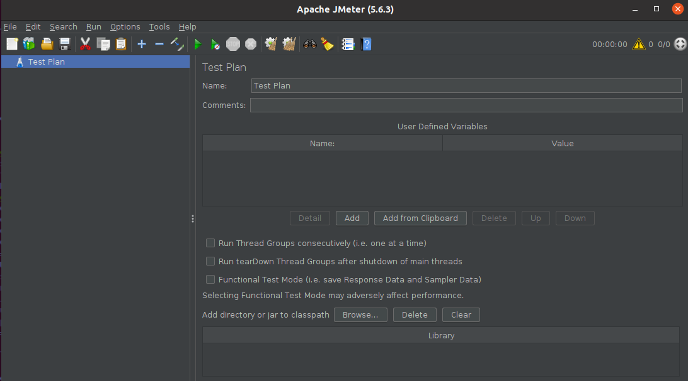
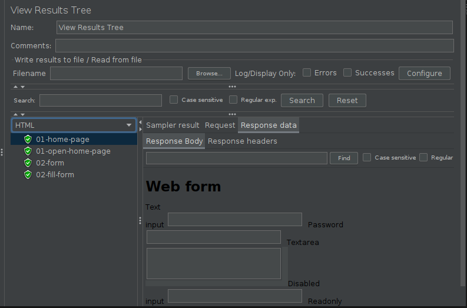

# Instalação no Linux
 - Instale o Java
```
sudo apt install default-jre
```

- Verifique a versão
```
java -version
```
- resultado
```
openjdk version "11.0.23" 2024-04-16
OpenJDK Runtime Environment (build 11.0.23+9-post-Ubuntu-1ubuntu120.04.2)
OpenJDK 64-Bit Server VM (build 11.0.23+9-post-Ubuntu-1ubuntu120.04.2, mixed mode, sharing)
```
- Baixe o binário do Jmeter (arquivo zip) da página https://jmeter.apache.org/download_jmeter.cgi
- Descompacte o zip
- Navegue até a pasta `./apache-jmeter-5.6.3/bin`
- Inicialize o Jmeter pelo binário `*.sh`
```
./jmeter.sh
```
- ou pelo comando Java
```
java -jar ApacheJMeter.jar
```
- O programa é inicializado


# Execução do exemplo
- Vá à opção `File > Open`, navegue até o arquivo `./ferramentas/jmeter/sample.jmx` e o abra.

- Selecione o nó `Test Plan` e execute o test clicando no botão  do menu principal
- Clique em `Summary Report` para ver os tempos de resposta e
- Clique em `View Results Tree` e selecione `HTML` para ver as páginas renderizadas

